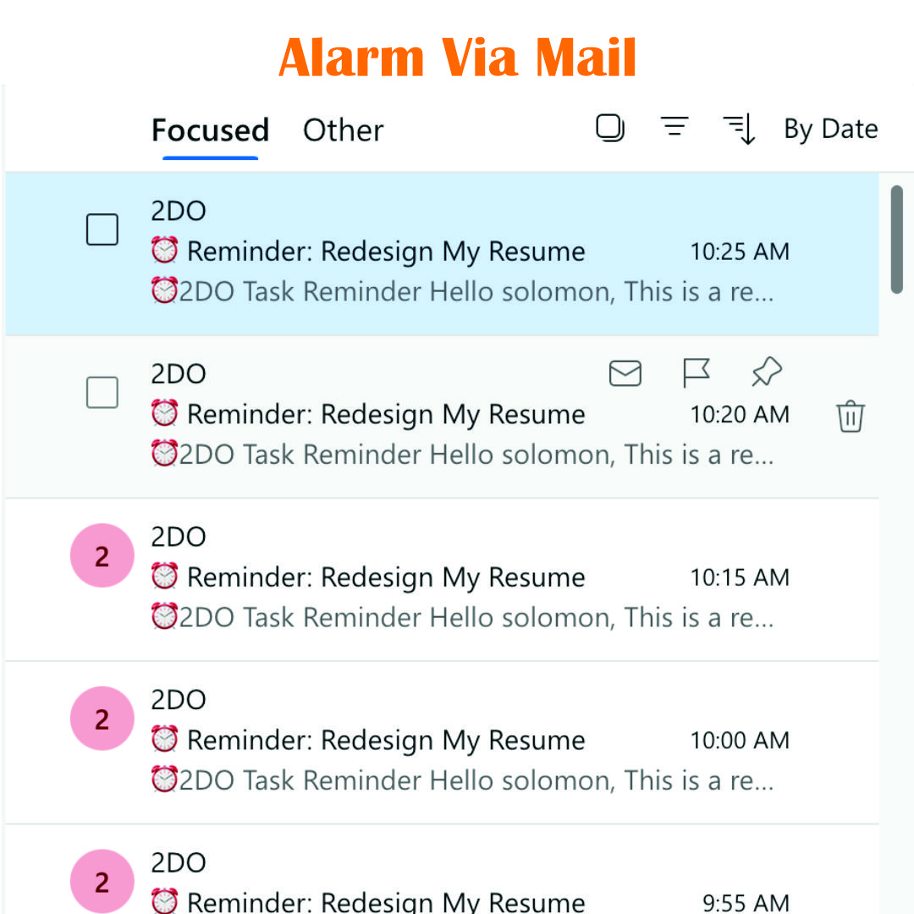
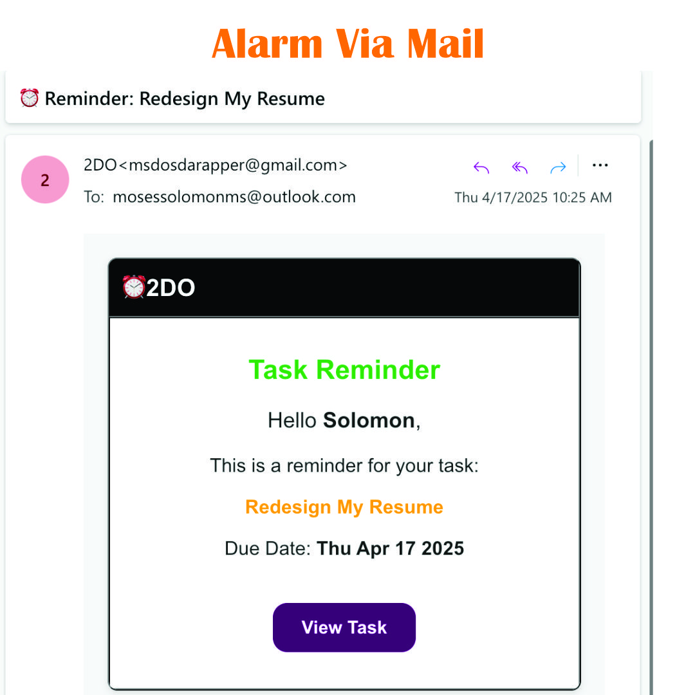
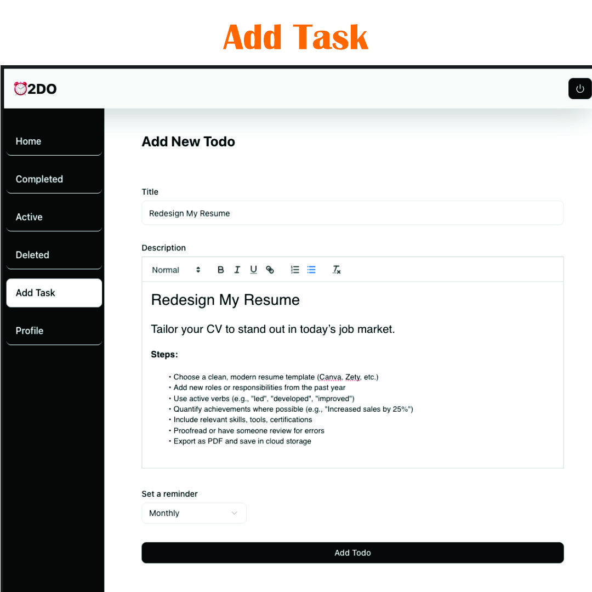
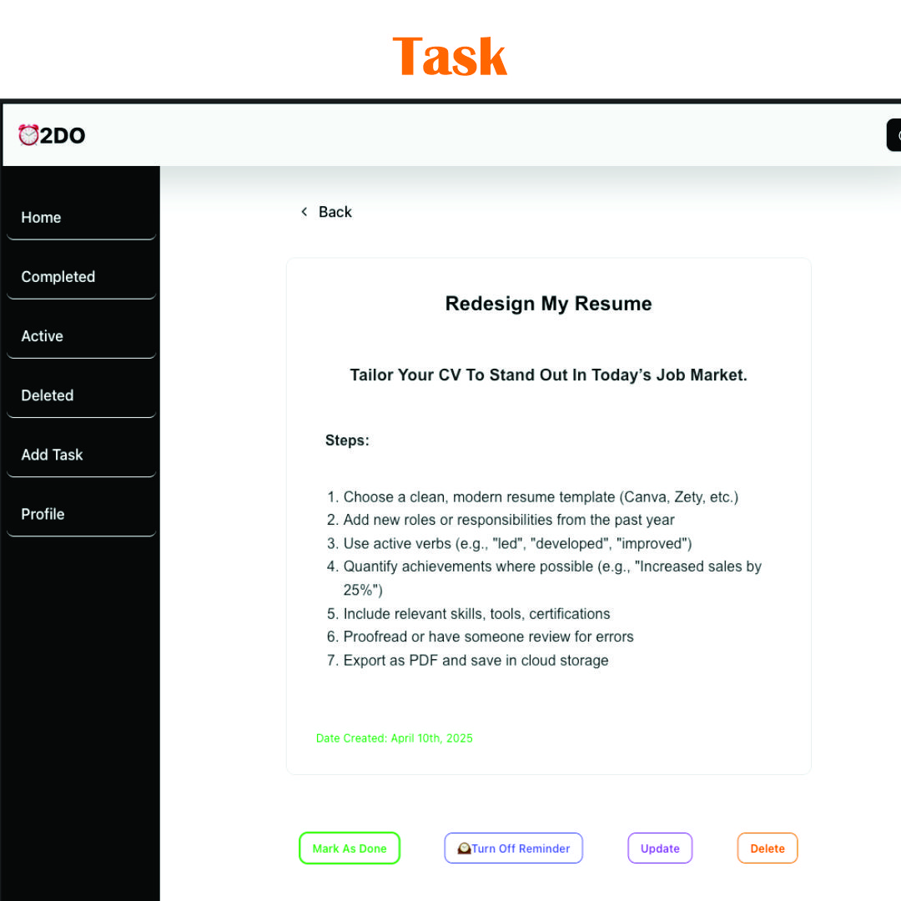

# 📝 2do — Advanced To-Do App WIth Reminder ⏰

An advanced, production-grade To-Do application designed to help users beat procrastination and stay consistent with their routines.  
**2do** combines robust authentication, an intelligent notification system, and industry-level server practices — making it scalable and reliable for real-world applications.

[Preview Project](https://twodo-r0as.onrender.com/)

---





## 🚀 Features

### ✅ Task Management

- Create, update, and delete tasks effortlessly.

  

- Mark tasks as complete or pending.

  

- Organize tasks by priority, deadline, or category.

---

### 🔐 Advanced Authentication

- **Email Verification:**  
  On registration, users receive a **six-digit verification code** in their email. Accounts are only activated after successful validation.

- **Secure Session + JWT Hybrid:**
  - Express Session: Secure, server-managed user sessions.
  - JWT Tokens: Stateless protection for sensitive API endpoints.

---

### ⏰ Smart Notification System

A proactive reminder system to eliminate procrastination:

- Select a reminder frequency when creating tasks:

  - `Hourly`
  - `Daily`
  - `Weekly`
  - `Monthly`
  - `Yearly`

- The system automatically dispatches **well-formatted email reminders** based on the selected interval, helping users stay consistent with their routines.

---

### 🛡️ Rate Limiting

- Implemented using **Arject** for intelligent rate control.
- Helps prevent abuse, spamming, and brute-force attacks.
- Ensures fair usage and system stability.

---

### 🧪 Robust Testing

- **Unit and Integration Tests** written for all core server logic.
- Follows an industry-standard test-driven structure, making the codebase easy to maintain, scale, and extend.
- A reliable foundation suitable for real-world production environments.

---

### 📬 Email Notification Highlights

- Clean, human-friendly, and well-structured email templates.
- Personalized with task details and next steps.
- Functions as a digital accountability partner for task consistency.

---

## ⚙️ Tech Stack

- **Frontend:** React Vite, Tanstackquery, Tailwind Css, Redux Took Kit
- **Backend:** Node.js, Express.js
- **Authentication:** Express Session + JWT Strategy
- **Email Service:** Nodemailer (configurable provider support)
- **Database:** MongoDB with Mongoose
- **Rate Limiting:** Arject
- **Testing:** Industry-standard test coverage (e.g., Jest / Mocha / Supertest)

---

## 💡 How It Works

1. **User Registration**

   - Users register with an email and password.
   - A **6-digit verification code** is sent to their email.
   - Only verified accounts are granted access.

2. **Task Creation**

   - Authenticated users can create tasks by providing:
     - Task Title
     - Description
     - Deadline
     - Notification Interval (Hourly, Daily, Weekly, Monthly)

3. **Reminder Engine**

   - Background service continuously monitors tasks.
   - Email reminders are sent at the configured intervals.

4. **Rate Limiting Protection**

   - Incoming requests are filtered and rate-controlled using Arject.
   - Abusive behavior is mitigated in real-time.

5. **Testing**
   - Critical server logic is covered by automated tests.
   - Test suites validate endpoints, edge cases, and expected behaviors.

---

## 💻 Installation & Setup

1. **Clone the repository:**

```bash
git clone https://github.com/Msdoshack/2do.git

cd 2do

npm install


PORT=3000
DB_URI=your_database_connection_string
JWT_SECRET=your_jwt_secret
EMAIL_USER=your_email_address
EMAIL_PASS=your_email_password
ARCJET_ENV=your_arcject_environment
ARCJET_KEY=your_arcject_key


npm test - to run test


```

### 💡 Why 2do?

#### 2do is more than a simple task manager it’s your virtual accountability partner

It helps you:

- Beat procrastnation.

- Stay on track with your routines.
- Build consistent productivity habits.

### 👤 Author

Msdoshack

[GitHub](https://github.com/Msdoshack)
